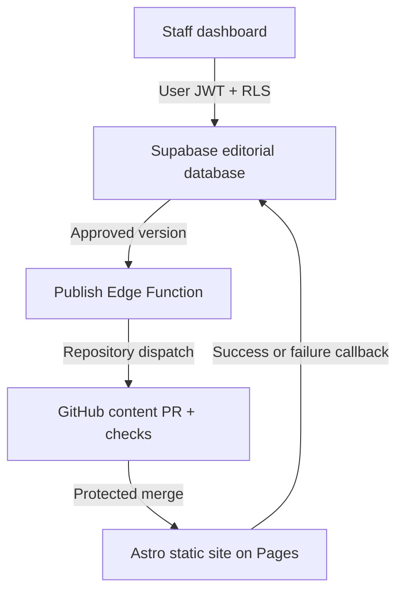

# Architecture

## Decisions

- The public website remains static Astro. It cannot query drafts and has no database secret.
- Supabase stores private working data. PostgreSQL constraints, triggers and RLS enforce the workflow even if the UI is bypassed.
- Published content is exported as Markdown. Git history is a portable, reviewable backup and the site can move to another static host.
- GitHub credentials exist only in Supabase Edge Function secrets and GitHub Actions secrets.
- The staff workspace is currently `/staff/` in this repository to minimize setup. It can move to a private repository and separate origin later without changing the database model.

## Trust boundaries

The browser receives only the Supabase URL and publishable key. `ctx.supabase` uses the signed-in user's RLS scope. `ctx.supabaseAdmin` is limited to server-side Edge Functions. GitHub Actions uses a secret key only to export an already-approved snapshot and send deployment feedback.
